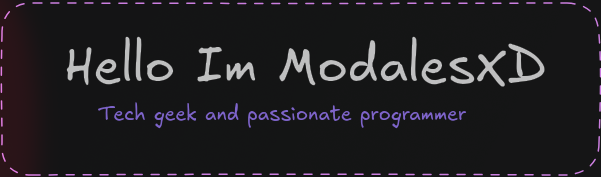

**Self-taught programmer. Linux enthusiast. Open source supporter.**

---

### 🚀 About Me

- I share knowledge openly.
- Passionate about Linux and Free Software.
- Always improving and learning new technologies.

---

### 🛠️ Stack I Use

  
  
  
  
  
  
  
  
  

---

### 📚 Currently Learning

---

### 📫 Contact Me

